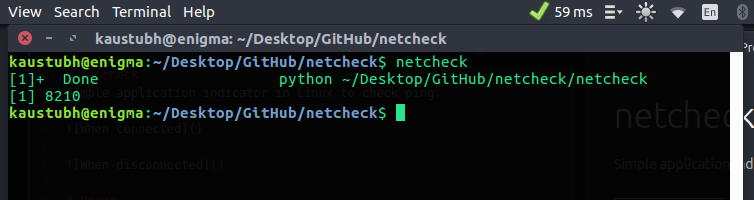
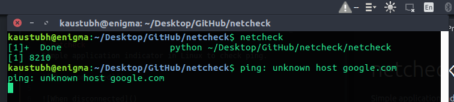
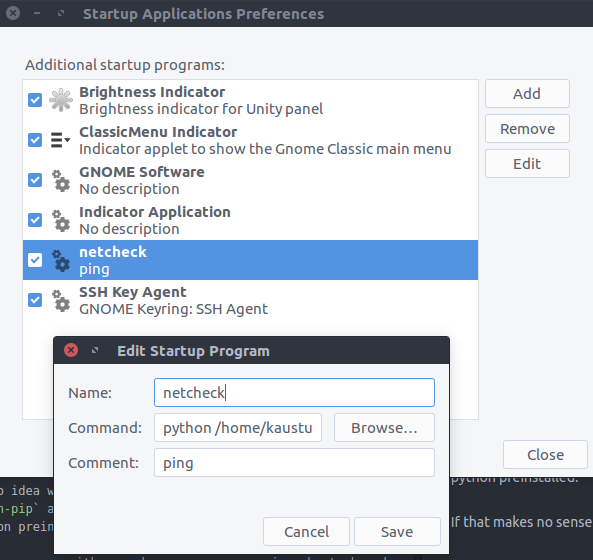

# netcheck
Simple application indicator in Linux to check [ping](http://www.computerhope.com/jargon/p/ping.htm).

Ping thumb of rule: <50 ms - great. Lower the better. (Jio best performance ~ 36 ms,average ~ 60ms )

* Connected demo

* Disconnected demo

# Usage

Add this to your ~/.bashrc file, with **correct** path:
<pre style="background: rgb(238, 238, 238); border: 1px solid rgb(204, 204, 204); padding: 5px 10px;">alias netcheck='python path/to/netcheck_folder/netcheck'</pre>

* To run in a new terminal (from any location) : `netcheck`

 The application terminates when the terminal is closed.

* To run the indicator at every startup, search `Startup Applications`>Add. Set command to `python absolute/location/of/netcheck_folder/netcheck` and save. The indicator must fire up at next start. An option is given to quit the application at any time.

----
Make sure you have installed `requests` and `pynotify`.If not,
write this in a terminal -

<pre style="background: rgb(238, 238, 238); border: 1px solid rgb(204, 204, 204); padding: 5px 10px;">pip install pynotify
pip install requests</pre>

If you have no idea what that meant, install pip - `sudo apt-get install python-pip` and then do the above step. It is assumed that you have python preinstalled.

If that makes no sense either, make sure you are using ubuntu-based OS.

----

If you are looking for a command line based tool(cli ), have a look at [speedtest-cli](http://ubuntuhandbook.org/index.php/2013/09/one-command-test-internet-bandwidth-ubuntu-terminal/) (supports download and upload speeds ). I wanted a basic visual indicator with *minimum RAM consumption, without external downloads*.This repo satisfies that criteria.

Have a suggestion? Make an issue about it.
